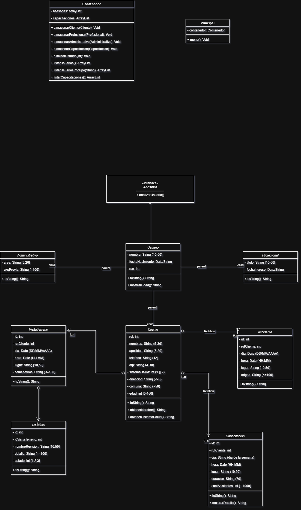

# Proyecto Desarrollo de Aplicaciones Moviles Android
## Modulo 2 Proyecto Prevencion de Riesgos

Proyecto en Java desarrollado en Eclipse
 
JDK-24

---
### Integrantes:
1. Ricardo Gallegos
2. Marglodis Tovar
3. Cristian Miranda
4. Gonzalo Lemus
---
* [X] Interface Asesoria    (Ricardo)
* Clases
    + [X] Usuario   (Ricardo)
        + [X] Administativo (Cristian)
        + [X] Profesional   (Marglodis)
        + [X] Cliente       (Gonzalo)
            + [X] Accidente (Ricardo)
            + [ ] Capacitacion  (Cristian)
            + [ ] VisitaTerreno (Marglodis)
                + [ ] Revision  (Marglodis)
        + [ ] Contenedor    (Ricardo)
            + [ ] Principal (Ricardo)
---

---
